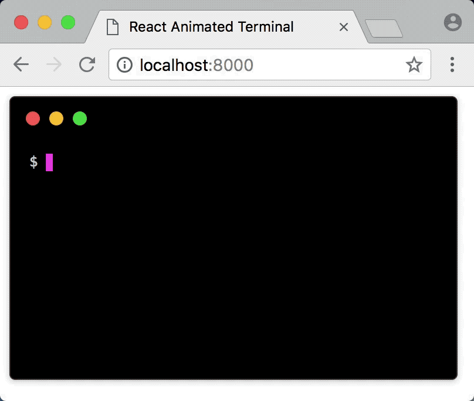
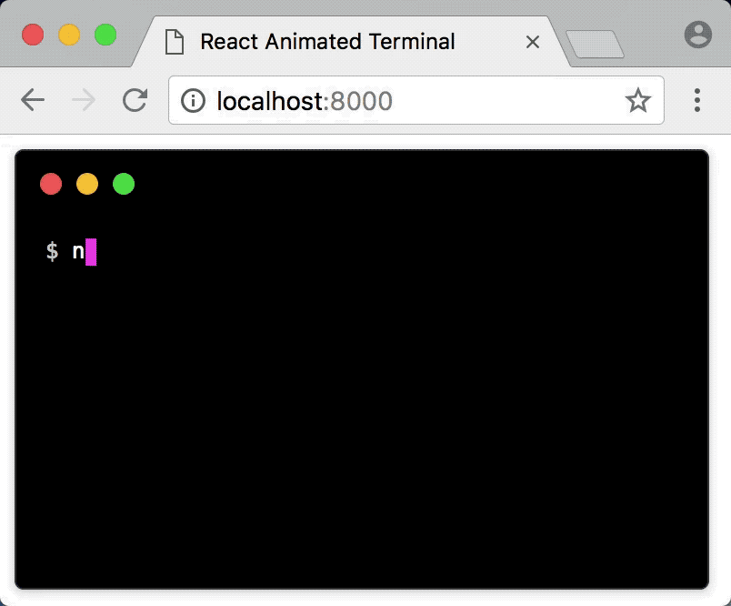
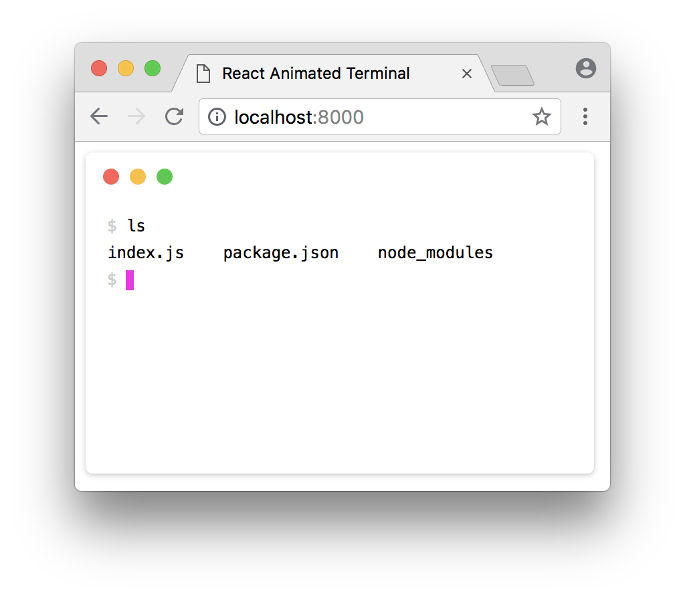

# React-Animated-Term

[](https://travis-ci.org/dongy7/react-animated-term)

> Animated terminal component for [React](https://reactjs.org/)

<p align="center">
  <br>
  
  <br>
  <br>
</p>

## Installation

For use with [webpack](https://webpack.js.org/) or other module bundlers:
```
npm install --save react-animated-term
```

You can then import `react-animated-term` and its styles.
```js
import Terminal from 'react-animated-term'
import 'react-animated-term/dist/react-animated-term.css'
```

## Usage

The terminal commands and output lines are specified as an array of objects. The `text` field specifies the content of the line and `cmd` is used to specify whether the line is a command or an output. The `interval` prop specifies how often the terminal should be updated.

```js
import React from 'react'
import Terminal from 'react-animated-term'

const termLines = [
  {
    'text': 'ls',
    'cmd': true
  },
  {
    'text': 'index.js    package.json    node_modules',
    'cmd': false
  },
  {
    'text': '',
    'cmd': true
  }
]

class App extends React.Component {
  render() {
    return (
      <Terminal
        lines={termLines}
        interval={80}
      />
    )
  }
}
```

### Framed Animation

<p align="center">
  <br>
  
  <br>
  <br>
</p>

You can also render output that consists of frames by specifying the individual frames. With a framed output, the `text` field specifies the final output that should be rendered after all the frames have been rendered. Delays can also be specified for individual frames and commands.

```js
import React from 'react'
import Terminal from 'react-animated-term'
const spinner = ['⠋', '⠙', '⠹', '⠸', '⠼', '⠴', '⠦', '⠧', '⠇', '⠏']
const termLines = [
  {
    text: 'node example.js',
    cmd: true,
    delay: 80
  },
  {
    text: '✔ Loaded app',
    cmd: false,
    repeat: true,
    repeatCount: 5,
    frames: spinner.map(function (spinner) {
      return {
        text: spinner + ' Loading app',
        delay: 40
      }
    })
  },
  {
    text: '',
    cmd: true
  }
]

class App extends React.Component {
  render() {
    return (
      <Terminal
        lines={termLines}
        interval={80}
      />
    )
  }
}
```

### Themes

A white themed terminal is specified using the `white` prop.

<p align="center">
  <br>
  
  <br>
  <br>
</p>

```js
import React from 'react'
import Terminal from 'react-animated-term'

class App extends React.Component {
  render() {
    return (
      <Terminal
        lines={termLines}
        interval={80}
        white
      />
    )
  }
}
```

### Props
| Property | Type | Default | Description |
|:---|:---|:---|:---|
| lines | array| undefined | array of terminal lines |
| interval | number | 100 | interval at which terminal output is updated in milliseconds |
| white | boolean | false | whether to render a white themed terminal |
| height | number | 240 | the height of the terminal |

### Examples

To run the examples, clone and install the dependencies.
```
$ git clone https://github.com/dongy7/react-animated-term.git
$ npm install
```

Then, run the `start` script and open up `http://localhost:8000`.

```
$ npm run start
```

## Credits

The styling for the terminal was adapted from the [Hyper](https://hyper.is/) terminal.